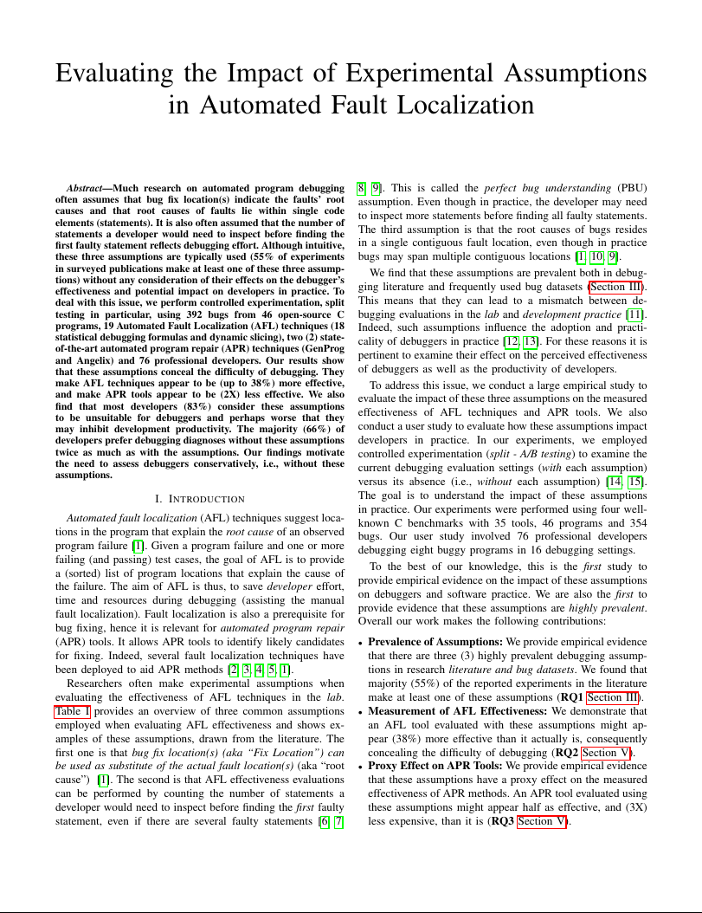
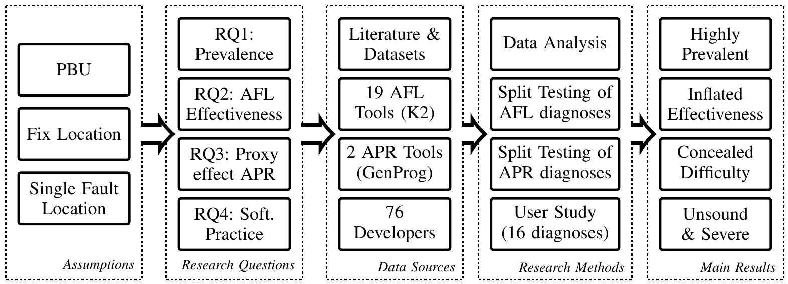
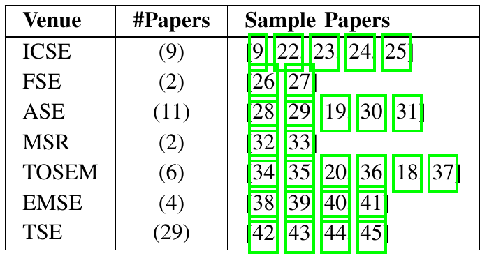
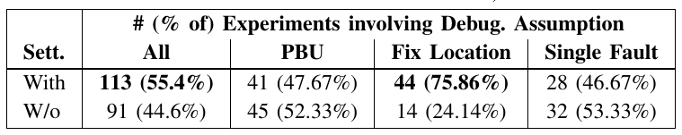
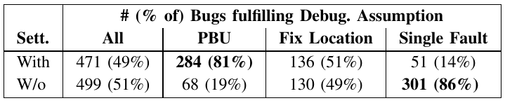
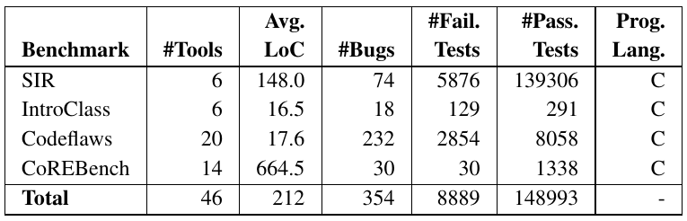

# Summary

Much research on automated program debugging often assumes that bug fix location(s) indicate the faults’ root causes and that root causes of faults lie within single code elements (statements).
It is also often assumed that the number of statements a developer would need to inspect before finding the first faulty statement reflects debugging effort.
Although intuitive, these three assumptions are typically used (55% of experiments in surveyed publications make at least one of these three assumptions) without any consideration of their effects on the debugger’s effectiveness and potential impact on developers in practice.
To deal with this issue, we perform controlled experimentation, split testing in particular, using 352 bugs from 46 open-source C programs, 19 Automated Fault Localization (AFL) techniques (18 statistical debugging formulas and dynamic slicing), two (2) state-of-the-art automated program repair (APR) techniques (GenProg and Angelix) and 76 professional developers.
Our results show that these assumptions conceal the difficulty of debugging.
They make AFL techniques appear to be (up to 38%) more effective, and make APR tools appear to be (2X) less effective.
We also find that most developers (83%) consider these assumptions to be unsuitable for debuggers and, perhaps worse, that they may inhibit development productivity.
The majority (66%) of developers prefer debugging diagnoses without these assumptions twice as much as with the assumptions.
Our findings motivate the need to assess debuggers conservatively, i.e., without these assumptions.

<p style="position:fixed; left: 50%; top: 300px; transform: translate(-515px, 0%); width: 170px; padding: 0px">
<a href="#faq">FAQ</a><br/>
<a href="#setup">Setup</a><br/>
<a href="#cite">How to cite</a><br/>
<a href="artifact/ARTIFACT">Artifact Readme</a><br/>
<a href="artifact/DOCKER">Docker Readme</a><br/>
<a href="https://figshare.com/articles/conference_contribution/Debugging_Assumptions_Artifact/21786743">Download the Artifact</a><br/>
<a href="https://drive.google.com/file/d/1Q0lqaZtoC_rKP41RxyWshaNU-z9x49Wa/view?usp=sharing" target="_blank"></a></p>

<br/>

## Main Objective


## Contributions

## Experimental Approach
In a controlled experiment, we analyzed the effectiveness of 19 fault localization techniques under the presence and absence of these assumptions.
We analyzed the impact of the assumptions on 2 popular automated program repair (APR) tools and conducted an user study with 76 developers to measure soundness, severity and utility of these assumptions in practice.

<p style="text-align: center;">
<br />
<i>Workflow of our approach</i>
</p>


### Prevalence analysis (Survey)
To evaluate the prevalence of the three assumptions in literature, we surveyed a large number of publications related to the topics of automated fault localization and automated program repair.

<p style="text-align: center;">
<br />
<i>Venues we examined and collected literature from</i>
</p>

We found those assumptions to be highly prevalent in the existing literature: 55% of experiments in the surveyed publications make at least one of the three assumptions.
Similarly, about half (49%) of the bugs in the bug datasets are impacted by at least one of the three assumptions.

<p style="text-align: center;">
<br />
<br />
<i>Prevalence of the examined debugging assumptions in experiments (top) and bugs (bottom) in practice</i>
</p>

### AFL and APR Experiments

In the automated fault localization (AFL) and automated program repair (APR) experiments, we employed 4 bug datasets (CoreBench, SIR, IntroCLass and Codeflaws) including a high variance of bugs (real, seeded, mutated) and a varying complexity and maturity of programs.

<p style="text-align: center;">
<br />
<i>Benchmarks that were used in the AFL and APR experiments</i>
</p>

### User Study

TODO


## <a name="setup" /> Setup and Infrastructure

See _[how to set up and run the artifact (Artifact README)](artifact/ARTIFACT.md)_.

* **Download** the [artifact and datasets](https://figshare.com/articles/conference_contribution/Debugging_Assumptions_Artifact/21786743) (MIT licensed)
* **Read** the [full paper](https://drive.google.com/file/d/1Q0lqaZtoC_rKP41RxyWshaNU-z9x49Wa/view?usp=sharing) (ICSE 2023)

# <a name="cite" /> How to cite?

```bibtex
@inproceedings{debug-assumptions, 
    author = {Soremekun, Ezekiel and Kirschner, Lukas and B\"{o}hme, Marcel and Papadakis, Mike}, 
    title = {Evaluating the Impact of Experimental Assumptions in Automated Fault Localization}, 
    booktitle = {Proceedings of the ACM/IEEE 45th International Conference on Software Engineering}, 
    series = {ICSE 2023}, 
    pages = {1-13}, 
    year = {2023},
}
```

### Cite the artifact

```bibtex
@article{Soremekun2023,
    author = "Ezekiel Soremekun and Lukas Kirschner and Marcel Böhme and Mike Papadakis",
    title = "{Artifact for Evaluating the Impact of Experimental Assumptions in Automated Fault Localization}",
    year = "2023",
    month = "1",
    url = "https://figshare.com/articles/conference_contribution/Debugging_Assumptions_Artifact/21786743",
    doi = "10.6084/m9.figshare.21786743.v6"
} 
```

# Who are we?

* [Ezekiel Soremekun](https://ezekiel-soremekun.github.io/), [RHUL UK](https://www.royalholloway.ac.uk/) & [SnT](https://wwwfr.uni.lu/snt), Luxembourg
* [Lukas Kirschner](https://www.lukaskirschner.de), [Interdisciplinary Centre for Security, Reliability and Trust](https://wwwfr.uni.lu/snt), Reliability and Trust, Luxembourg
* [Marcel Böhme](https://mboehme.github.io/), Max Planck Institute for Security and Privacy Bochum, Germany
* [Mike Papadakis](https://mpapad.github.io/), [Interdisciplinary Centre for Security, Reliability and Trust](https://wwwfr.uni.lu/snt), Luxembourg

# <a name="faq" /> FAQ

# Links
